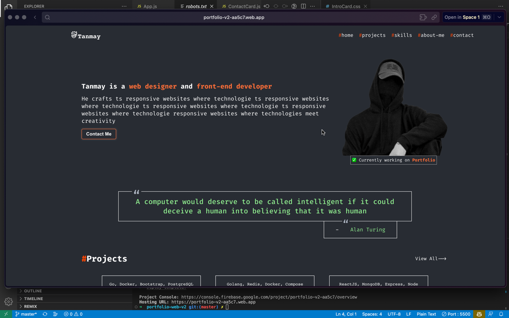

<a name="readme-top"></a>

<!-- PROJECT LOGO -->
<br />
<div align="center">

  <a href="https://github.com/sarkartanmay393/Portfolio-V2">
    
  </a>

<h3 align="center">Portfolio V2</h3>

[![Contributors][contributors-shield]][contributors-url]
[![Forks][forks-shield]][forks-url]
[![Stargazers][stars-shield]][stars-url]
[![Issues][issues-shield]][issues-url]
[![LinkedIn][linkedin-shield]][linkedin-url]

<p align="center">
   It is the TS zone with JS
   <br />
   <a href="https://github.com/sarkartanmay393/
Portfolio-V2"><strong>Explore Code »</strong></a>
   <br />
   <br />
   <a href="https://portfolio-v2-aa5c7.web.app/" target="_blank" rel="noopener noreferrer" >View Demo</a>
   ·
   <a href="https://github.com/sarkartanmay393/Portfolio-V2/
issues">Report Bug</a>
   ·
   <a href="https://github.com/sarkartanmay393/Portfolio-V2/
issues">Request Feature</a>
 </p>

</div>

<!-- TABLE OF CONTENTS -->
<details>
  <summary>Table of Contents</summary>
  <ol>
    <li>
      <a href="#about-the-project">About The Project</a>
      <ul>
        <li><a href="#built-with">Built With</a></li>
      </ul>
      <ul>
        <li><a href="#things-i-learned">Things I Learned</a></li>
      </ul>
      <ul>
        <li><a href="#packages-i-used">Packages I Used</a></li>
      </ul>
      <ul>
        <li><a href=“#screenshots">Screenshots</a></li>
      </ul>
      <ul>
        <li><a href=“#extras">Extras</a></li>
      </ul>
    </li>
    <li>
      <a href="#getting-started">Getting Started</a>
      <ul>
        <li><a href="#prerequisites">Prerequisites</a></li>
        <li><a href="#steps-to-run">Steps to run</a></li>
      </ul>
    </li>
    <li><a href="#roadmap">Roadmap</a></li>
    <li><a href="#contact">Contact</a></li>
  </ol>
</details>

<!-- ABOUT THE PROJECT -->
## About The Project

### Built With

[![React][React-shield]][React-url]
[![Firebase][Firebase-shield]][Firebase-url]

### Things I Learned

1. Advance Understanding of Web App.
2. Grasped React Usages.
3. Learned JavaScript well.

### Packages I Used

1. firebase: ^9.16.0

### Screenshots

<details>
   <summary><strong>Show</strong> </summary>

<div style="text-align: center;"> <strong><i>Homepage</i></strong></div>



</details>

### Extras

##### Previous Portfolio: [**Portfolio With Flutter**](https://portfolio-web-1ad94.web.app/#/home)

<p align="right">(<a href="#readme-top">back to top</a>)</p>

<!-- GETTING STARTED -->
## Getting Started

Running a development environment for this project will be the easiest thing in you day.

### Prerequisites

* [**Node**](https://nodejs.org/en/)

### Steps to run

* Clone the repository

  ```zsh
  git clone https://github.com/sarkartanmay393/Portfolio-V2.git
  ```

* Start react project

  ```zsh
  npm start 
  ```

<br />

> If any issue occured while running, redo everything.

<p align="right">(<a href="#readme-top">back to top</a>)</p>

<!-- CONTRIBUTING -->
## Contributing

Contributions are what make the open source community such an amazing place to learn, inspire, and create. Any contributions you make are **greatly appreciated**.

If you have a suggestion that would make this better, please fork the repo and create a pull request. You can also simply open an issue with the tag "enhancement" or "good-first-issues".
Don't forget to give the project a star! Thanks again!

1. Fork the Project
2. Create your Feature Branch (`git checkout -b feature/AmazingFeature`)
3. Commit your Changes (`git commit -s -m 'Add some AmazingFeature'`)
4. Push to the Branch (`git push origin feature/AmazingFeature`)
5. Open a Pull Request
6. Wait for review

> All of your commits should be signed always.

<p align="right">(<a href="#readme-top">back to top</a>)</p>

<!-- ROADMAP -->
## Roadmap

* [x] Styling
* [ ] Database
* [x] New Responsive UI
* [ ] Web Application
* [ ] Spotify Integration
* [ ] Email Service

See the [open issues](https://github.com/sarkartanmay393/Portfolio-V2/issues) for a full list of proposed features (and known issues).

<!-- CONTACT -->
## Contact

Your Name - Tanmay Sarkar [@sarkartanmay393](https://twitter.com/sarkartanmay393) - [hello@tanmaysarkar.tech](mailto:hello@tanmaysarkar.tech)

Project Link: [https://github.com/sarkartanmay393/Portfolio-V2](https://github.com/sarkartanmay393/Portfolio-V2)

**Thanks for visiting my project. If you like it, please give it a star. It will help me a lot. Thanks again!**

<p align="right">(<a href="#readme-top">back to top</a>)</p>

<!-- MARKDOWN LINKS & IMAGES -->
<!-- https://www.markdownguide.org/basic-syntax/#reference-style-links -->
[contributors-shield]: https://img.shields.io/github/contributors/sarkartanmay393/Portfolio-V2.svg?style=for-the-badge
[contributors-url]: https://github.com/sarkartanmay393/Portfolio-V2/graphs/contributors
[forks-shield]: https://img.shields.io/github/forks/sarkartanmay393/Portfolio-V2.svg?style=for-the-badge
[forks-url]: https://github.com/sarkartanmay393/Portfolio-V2/network/members
[stars-shield]: https://img.shields.io/github/stars/sarkartanmay393/Portfolio-V2.svg?style=for-the-badge
[stars-url]: https://github.com/sarkartanmay393/Portfolio-V2/stargazers
[issues-shield]: https://img.shields.io/github/issues/sarkartanmay393/Portfolio-V2.svg?style=for-the-badge
[issues-url]: https://github.com/sarkartanmay393/Portfolio-V2/issues

[linkedin-shield]: https://img.shields.io/badge/-LinkedIn-black.svg?style=for-the-badge&logo=linkedin&colorB=555
[linkedin-url]: https://linkedin.com/in/tanmaysrkr

[React-shield]: https://img.shields.io/badge/React-027d9c?style=for-the-badge&logo=React&logoColor=white
[React-url]: https://reactjs.org

[Firebase-shield]: https://img.shields.io/badge/Firebase-027d9c?style=for-the-badge&logo=Firebase&logoColor=white
[Firebase-url]: https://firebase.google.com/
